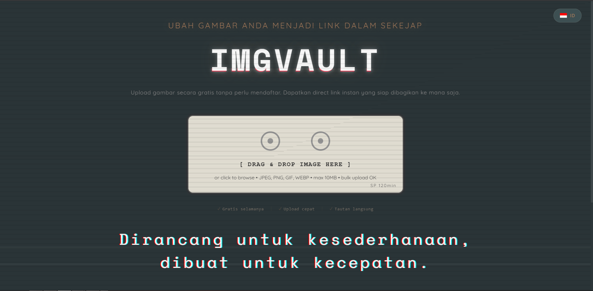
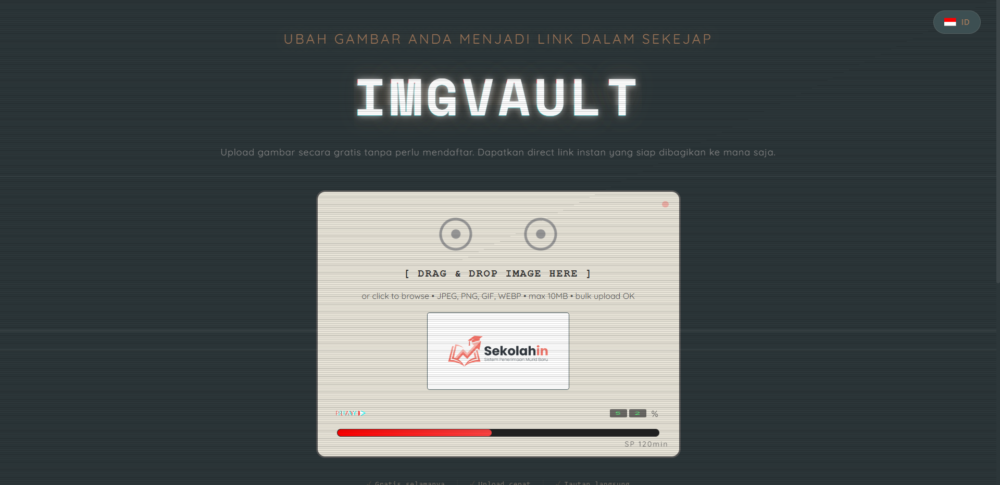
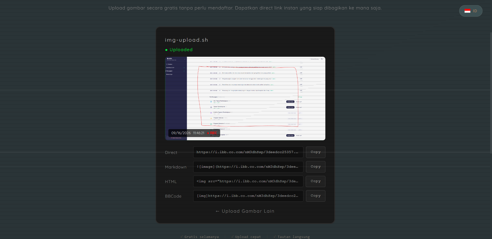

<div align="center">

  <h1>ImgVault</h1>

  <p>
    Upload gambar gratis tanpa daftar. Dapat direct link instan — siap dibagikan ke mana saja.
  </p>


<!-- Badges -->
<p>
  <a href="https://github.com/rry69/imgvault/stargazers">
    
  </a>
  <a href="https://github.com/rry69/imgvault/network/members">
    
  </a>
  <a href="https://github.com/rry69/imgvault/issues/">
    
  </a>
  <a href="https://github.com/rry69/imgvault/blob/main/LICENSE">
    
  </a>
  
  
</p>

<h4>
    <a href="https://github.com/rry69/imgvault/issues/">Report Bug</a>
  <span> · </span>
    <a href="https://github.com/rry69/imgvault/issues/">Request Feature</a>
  </h4>
</div>

<br />

<!-- Table of Contents -->
# :notebook_with_decorative_cover: Table of Contents

- [About the Project](#star2-about-the-project)
  * [Screenshots](#camera-screenshots)
  * [Tech Stack](#space_invader-tech-stack)
  * [Features](#dart-features)
  * [Color Reference](#art-color-reference)
  * [Environment Variables](#key-environment-variables)
- [Getting Started](#toolbox-getting-started)
  * [Prerequisites](#bangbang-prerequisites)
  * [Installation](#gear-installation)
  * [Run Locally](#running-run-locally)
  * [Deployment](#triangular_flag_on_post-deployment)
- [Usage](#eyes-usage)
- [Roadmap](#compass-roadmap)
- [FAQ](#grey_question-faq)
- [License](#warning-license)
- [Contact](#handshake-contact)
- [Acknowledgements](#gem-acknowledgements)


<!-- About the Project -->
## :star2: About the Project

ImgVault adalah image hosting ringan berbahasa Indonesia: drag & drop gambar, upload ke ImgBB, langsung dapat link dalam 4 format (Direct, Markdown, HTML, BBCode). Tanpa registrasi, tanpa database wajib untuk upload guest — database hanya mencatat metadata + rate limit.

<!-- Screenshots -->
### :camera: Screenshots

<div align="center">
  
  <br />
  <em>Landing — widget upload gaya kaset retro</em>
  <br /><br />
  
  <br />
  <em>Uploading — status READY + progress bar</em>
  <br /><br />
  
  <br />
  <em>Result — direct link + Markdown + HTML + BBCode, siap copy</em>
</div>


<!-- TechStack -->
### :space_invader: Tech Stack

<details>
  <summary>Client</summary>
  <ul>
    <li>HTML + CSS + Vanilla JS (no framework)</li>
  </ul>
</details>

<details>
  <summary>Server</summary>
  <ul>
    <li><a href="https://www.php.net/">PHP</a> (>= 8.1, no framework)</li>
    <li><a href="https://api.imgbb.com/">ImgBB API</a> (image storage provider)</li>
  </ul>
</details>

<details>
<summary>Database</summary>
  <ul>
    <li><a href="https://www.mysql.com/">MySQL</a> 8 (metadata + rate limit; upload guest tetap jalan tanpa DB)</li>
  </ul>
</details>

<details>
<summary>DevOps</summary>
  <ul>
    <li>Apache + <code>.htaccess</code> (HTTPS redirect, proteksi file sensitif)</li>
  </ul>
</details>

<!-- Features -->
### :dart: Features

- Drag & drop, klik browse, paste dari clipboard, bulk upload
- Direct link instan + tombol copy per format: Direct, Markdown, HTML, BBCode
- JPEG, PNG, GIF, WEBP — maks 10MB (configurable via `MAX_UPLOAD_SIZE`)
- CSRF protection + rate limit per IP (tabel `rate_limits`)
- Dashboard statistik upload
- UI bilingual ID/EN + retro cassette widget

<!-- Color Reference -->
### :art: Color Reference

| Color             | Hex                                                                |
| ----------------- | ------------------------------------------------------------------ |
| Background (teal charcoal) |  #2d3436 |
| Primary text |  #EEEEEE |
| Tagline bronze |  #C98A4B |
| Cassette beige |  #E8DCC8 |
| Status green |  #2ECC71 |
| Progress red |  #E74C3C |

> Nilai hex di atas perkiraan dari screenshot — kalibrasi ulang dari `assets/css/style.css` bila butuh presisi.

<!-- Env Variables -->
### :key: Environment Variables

Copy `.env.example` ke `.env`, lalu isi:

`IMGBB_API_KEY` — API key dari [api.imgbb.com](https://api.imgbb.com)

<!-- Getting Started -->
## 	:toolbox: Getting Started

<!-- Prerequisites -->
### :bangbang: Prerequisites

- PHP >= 8.1 + ekstensi `curl`, `pdo_mysql`
- MySQL 8 / MariaDB
- Apache (atau Laragon/XAMPP untuk lokal)
- API key ImgBB gratis

<!-- Installation -->
### :gear: Installation

1. Clone repo ini
2. Import `schema.sql` via phpMyAdmin (membuat tabel `images`, `rate_limits`, `users` — tanpa data)
3. Copy `.env.example` ke `.env`, isi `IMGBB_API_KEY`
4. Sesuaikan kredensial DB di `config/database.php`
5. Pastikan folder `uploads/temp/` writable (permission 755)

<!-- Run Locally -->
### :running: Run Locally

Clone the project

```bash
  git clone https://github.com/rry69/imgvault.git
```

Go to the project directory

```bash
  cd imgvault
```

Jalankan via Laragon / XAMPP (docroot ke folder project), lalu buka

```bash
  http://localhost/imgvault
```

<!-- Deployment -->
### :triangular_flag_on_post: Deployment

Upload ke `public_html/` via File Manager / FTP:

```bash
  # file wajib: index.php dashboard.php schema.sql
  # folder wajib: api/ assets/ config/ includes/ providers/ uploads/temp/
```

Set permission `uploads/temp/` → 755, import `schema.sql`, sesuaikan `config/database.php` + `.env`.


<!-- Usage -->
## :eyes: Usage

1. Buka halaman utama → drag & drop gambar ke widget kaset (atau klik / paste)
2. Tunggu progress selesai → status `Uploaded`
3. Klik `Copy` pada format yang dibutuhkan (Direct / Markdown / HTML / BBCode)
4. Klik `← Upload Gambar Lain` untuk upload berikutnya

Buka `dashboard.php` untuk statistik upload.

<!-- Roadmap -->
## :compass: Roadmap

* [x] Upload guest + 4 format link
* [x] Rate limit + CSRF protection
* [x] Dashboard statistik
* [ ] Login user + galeri pribadi (tabel `users` sudah siap)
* [ ] Multi-provider selain ImgBB
* [ ] Expiry link otomatis

<!-- FAQ -->
## :grey_question: FAQ

- Upload gagal?

  + Cek API key ImgBB di `.env`, pastikan ekstensi `curl` aktif, dan ukuran file ≤ limit.

- Database connection failed?

  + Cek kredensial di `config/database.php`. Upload guest tetap jalan walau DB down.

- Permission denied?

  + Set folder `uploads/temp/` ke 755 dan pastikan PHP bisa tulis.

<!-- License -->
## :warning: License

Distributed under the MIT License. See LICENSE for more information.


<!-- Contact -->
## :handshake: Contact

Harry Prasetyo - zaphkiela56@gmail.com

Project Link: [https://github.com/rry69/imgvault](https://github.com/rry69/imgvault)


<!-- Acknowledgments -->
## :gem: Acknowledgements

 - [Shields.io](https://shields.io/)
 - [Awesome README](https://github.com/matiassingers/awesome-readme)
 - [Emoji Cheat Sheet](https://github.com/ikatyang/emoji-cheat-sheet/blob/master/README.md#travel--places)
 - [Readme Template](https://github.com/othneildrew/Best-README-Template)
 - [ImgBB API](https://api.imgbb.com/)
